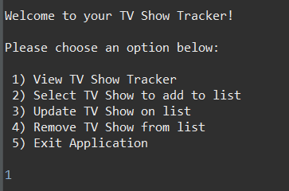
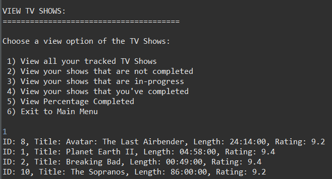
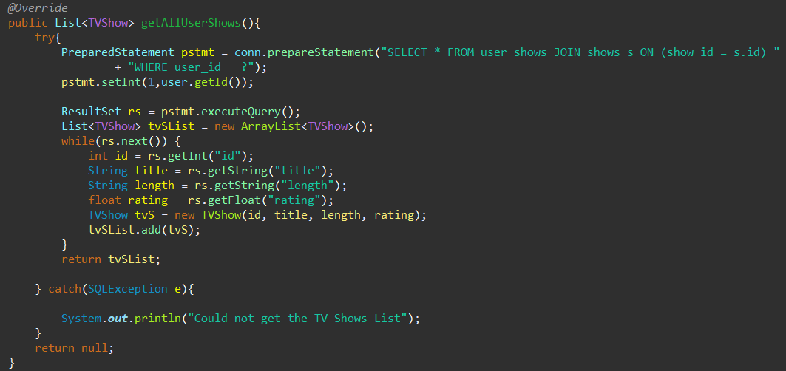
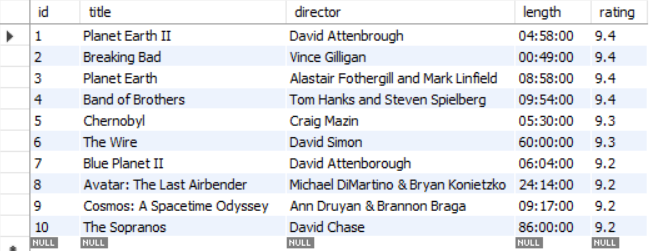
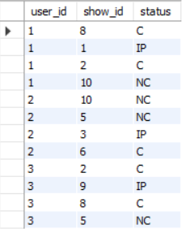

# TV Show Progress Tracker

## Overview

The TV Show Progress Tracker is a program to manage user lists of and progress on TV shows that they would like to watch. The user interface features a main menu, view menu as well as menus to add, update and delete shows from the user's custom list.

  

## Functionality

Once the user logs in, they will have the option to view all available shows to add to their list or view the shows that are already added to their list. Here is what the main menu looks like to the user.

On the view menu, users can view their entire list or show their list broken down by stages of progress. Progress indicators come in 3 forms: not started, in progress and completed. They can also what percentage of thier list has been completed. Below is what it looks like when a user chooses to view their entier list.

As mentioned earlier, users can also add shows to thier list, remove shows from their list or update the status of a particular show on their list. Navigation is faciliated by entering a number from the ordered lists in the menu options. Failing to enter an integer or an invalid number will return an error message and return the user to the menu.
## Development
TV Show Progress Tracker was developed in Java with integration with a MYSQL database on the back end. Requests are made through a DAO interface, which queries the database and returns the result. Here is the script of the DAO that displays the users list:

J-Unit tests were also employed to ensure consistency in returning results. Some custom exceptions were implemented in order inform the user of the precise type of error that was encountered. For example, if a user adds a show that is already present in their list, an exception will be caught that tells the user that the show is already present in their list.
## Database
Data is stored in a MYSQL relational database, which consists of 3 tables: <b>Users</b>, <b>Shows</b> and <b>User-Shows</b>. <b>Users</b> table stores the users name, username, password and auto-generated ID upon entry. <b>Shows</b> stores the entire list of shows that users have to choose from with relevant information about the show and another unique auto-generated ID. Here's what that table looks like.
 
Users don't have access to this table but it can be modified in the database itself.
 
The <b>User-Shows</b> table acts as both a join table for the <b>User</b> and <b>Shows</b> tables and as the storage system for all users. This table takes in the ID from the user and the ID of the show they want to add/remove/modify and records the status as a shorthand variable. This is a sample of how the <b>User-Shows</b> table will look.
 
Note: The database exists locally so this table will look differently depending on the interaction with the program
## Try it out!
Want to run the program yourself?
All you need to do is is clone the repository onto your system, run the 2 .sql files in your MYSQL database editor to create the database. Once it is created you can run the java program on a command prompt. Just enter one of the username/password combinations from the <b>Users</b> table and start experimenting!